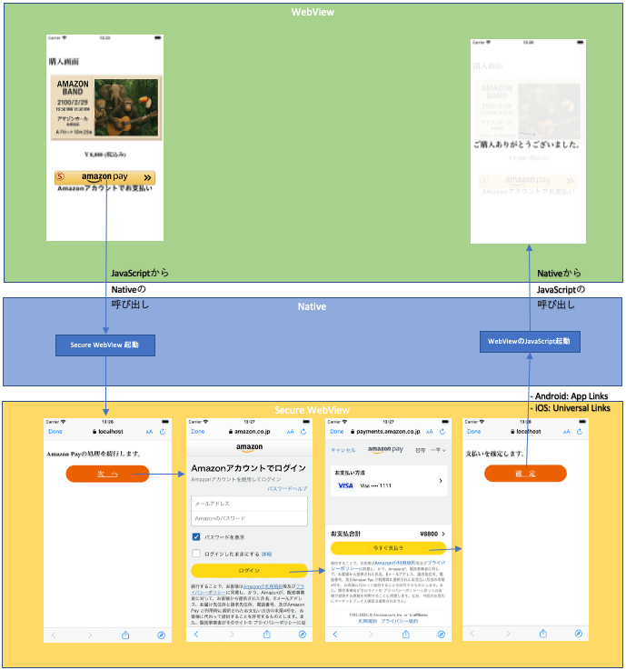
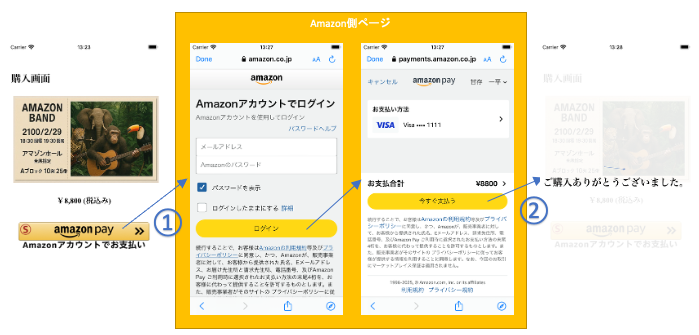
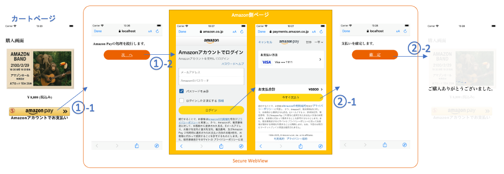

# 本サンプルアプリについて
SmartPhone上でAmazon Payで商品を購入する、モバイルアプリのサンプル実装です。  
GMO Payment Gateway(以下GMOPG)ご提供の[Amazon Pay cPSP](https://docs.mul-pay.jp/exsearch/amazonpay-cpsp/overview)の中の、[AdditionalPaymentButton(APB)](https://docs.mul-pay.jp/exsearch/amazonpay-cpsp/overview#9-1)という機能向けのサンプルアプリとなります。
WebViewアプリとして実装されていますが、Nativeアプリであってもこちらを参考にしてAmazon Payをご実装頂くことが可能です。  

Amazon Payの処理についてはモバイルアプリから使えるSecureなブラウザ技術である、  
  * Android: Chrome Custom Tabs  
  * iOS: SFSafariViewController  

を起動して実行しており、実行が終わるとまたアプリ側に処理を戻しています。  
※ 本ドキュメント 及び サンプルアプリのコード内では、「Chrome Custom Tabs」と「SFSafariViewController」の両方を合わせて「*Secure WebView*」と呼んでおります。  

その他の部分は、通常のAmazon Payの実装と同じです。  
よって、下記開発者用ページを参考にご実装いただけますし、また通常のPC/Mobileのブラウザ向けのページとソースコードの多くを共有することができます。  
https://docs.mul-pay.jp/exsearch/amazonpay-cpsp/overview  

本サンプルアプリも、通常のPC/Mobileのブラウザ向けの一般的なAmazon Payの実装と、モバイルアプリ(Android/iOS)向けの実装が同じコード上で実現されています。

モバイルアプリから使うことができるブラウザ技術としては、Secure WebViewの他にもWebViewがあります。  
WebViewはSecurity上の理由でAmazon Payではサポート対象となっておらず、WebViewで実装されているモバイルアプリの場合でも、そのままではAmazon Payを安全にご導入いただけません。  
参考: https://developer.amazon.com/ja/docs/amazon-pay-onetime/webview.html  
WebViewで構築されたアプリの場合でも、本サンプルアプリのやり方に従えばサポート対象となる安全な形での実装が可能ですので、是非ご活用下さい。  

本サンプルアプリはサーバー側の実装の[nodejs](nodejs/README.md)と、[android](android/README.md)、[ios](ios/README.md)の3つのプロジェクトで構成されており、それぞれのセットアップ方法 及び 利用している技術要素に関する説明も、それぞれのREADMEをご参照下さい。  

# 動作環境
Android 9以降: Google Chrome 78以降  
iOS バージョン12.3.1以降: Safari Mobile 12以降  
[参考] https://pay.amazon.com/jp/help/202030010

# 概要
本サンプルアプリはAndroid, iOS共に下記の動画のように動作します。

  

この動作は、下記の図のように  

* WebView ←→ Native ←→ Secure WebView  

が連携することで実現しています。

本サンプルアプリはWebViewで作成されておりますが、図を見ると分かる通り必ず一度Nativeの処理を経由してからSecure WebViewとやり取りをしています。  
なので、Nativeアプリであっても、WebViewで処理されている箇所をNativeに置き換えて頂くことで、本サンプルアプリを参考にAmazon Payをご実装いただくことが可能です。  

# Amazon Payをモバイルアプリで実装するために必要なタスクの概要
## [参考] PC・MobileのBrowser版への実装で必要なタスク
ここでモバイルアプリでの特有の作業の理解の前段として、Amazon PayをPC・MobileのBrowserに実装した場合の一般的なFlowについておさらいします。  

  

Flowの流れは下記の通りです。  

1. ECサイトのカートページや商品ページにAmazon Payボタンを描画します。
    - このとき、金額や送付先住所等の必要な情報はAmazon Pay起動パラメタとして指定します。
2. ①のAmazon Payボタンのタップにて、ECサイトを親ページとした子ページ(Modal Window)として、自動的にAmazon側ページが開きます。
3. ②でAmazon側ページ上の「今すぐ支払う」ボタンがクリックされると、
    - chargePermissionIdなど決済に必要な情報をパラメタとして、自動的に親ページ(ECサイト)のJavaScriptが実行されます。
    - このJavaScript内の処理にて、受け取ったパラメタ・金額・送付先住所等をGMOPGのAPIに渡して起動し、決済処理を実行します。

## モバイルアプリ版への実装で必要なタスク
Amazon Payをモバイルアプリに実装する場合も、基本的なFlowは同じで、一般的には下記のようになります。  

  

必要なタスクも基本的にはBrowserと多くは共通ですが、Amazon側の処理をSecure WebView上で実行しなくてはいけないため、一部追加のタスクもあります。  
Browserと違う部分に関しては、***太字***で表記します。  

### WebViewアプリの場合
下記のとおり、多くの部分がBrowserと共通になります。

1. ECサイトのカートページや商品ページに ***「Amazon Payボタン」の画像*** を表示します。
    - ***①-1でこの画像をタップした時、「Amazon Pay実行ページ」([android](android/README.md)、[ios](ios/README.md)にて後述)をSecure WebViewで表示します。***
    - このとき、金額や送付先住所等の必要な情報はAmazon Pay起動パラメタとして指定します。
2. ***①-2の「次へ」ボタン*** のタップにて、***Amazon Pay実行ページ*** を親ページとした子供ページ(Modal Window)として、自動的にAmazon側ページが開きます。
3. ***②-1*** でAmazon側画面上の「今すぐ支払う」ボタンがクリックされると、
    - chargePermissionIdなど決済に必要な情報をパラメタとして、自動的に親ページ(***Amazon Pay実行ページ***)のJavaScriptが実行されます。
    - ***Amazon Pay実行ページには「確定ボタン」が表示されます。②-2の「確定」ボタンのタップにて、Secure WebViewをCloseして、受け取ったパラメタを更にパラメタとしてECサイトのJavaScriptを実行します。***
    - このJavaScript内の処理から、受け取ったパラメタ・金額・送付先住所等をGMOPGのAPIに渡して実行する処理を起動し、決済処理を実行します。

### Nativeアプリの場合
下記のとおり、多くの部分がBrowserと共通となります。  
Nativeアプリの場合には画面の表示などはBrowserとは別に実装する必要はありますが、Secure WebView上の処理やServer側の処理などは共通です。  

1. アプリのカートページや商品ページに ***「Amazon Payボタン」の画像*** を表示します。
    - ***①-1でこの画像をタップした時、「Amazon Pay実行ページ」([android](android/README.md)、[ios](ios/README.md)にて後述)をSecure WebViewで表示します。***
    - このとき、金額や送付先住所等の必要な情報はAmazon Pay起動パラメタとして指定します。
2. ***①-2の「次へ」ボタン*** のタップにて、***Amazon Pay実行ページ*** を親ページとした子ページ(Modal Window)として、自動的にAmazon側ページが開きます。
3. ***②-1*** でAmazon側画面上の「今すぐ支払う」ボタンがクリックされると、
    - chargePermissionIdなど決済に必要な情報をパラメタとして、自動的に親ページ(***Amazon Pay実行ページ***)のJavaScriptが実行されます。
    - ***Amazon Pay実行ページには「確定ボタン」が表示されます。②-2の「確定」ボタンのタップにて、Secure WebViewをCloseして、アプリ側から受け取ったパラメタ・金額・送付先住所等をGMOPGのAPIに渡して実行する処理を起動し、決済処理を実行します。***

# 本サンプルアプリの詳細と動かし方の確認
最初に、[nodejs](nodejs/README.md)を参考に、Webアプリケーション側を動かして下さい。こちらは通常のブラウザからでも動作確認が可能です。  
その後に[android](android/README.md)と[ios](ios/README.md)を参考に、モバイルアプリを動かして下さい。  
