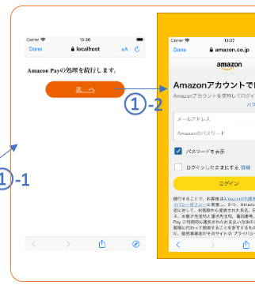
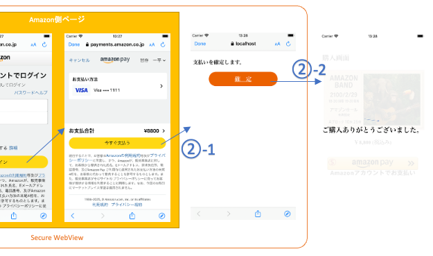
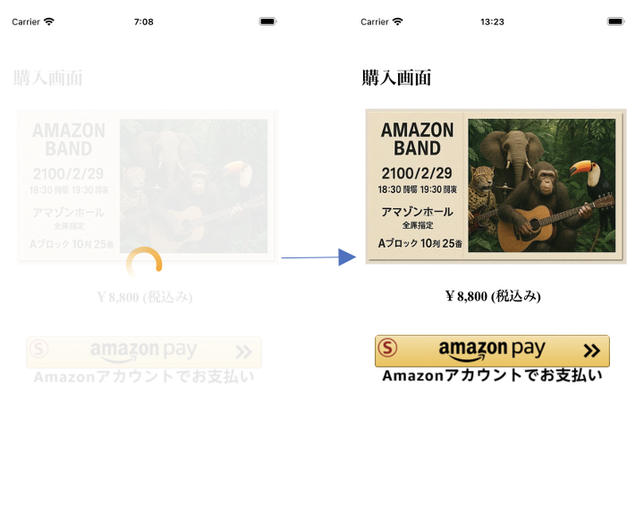

# Amazon Pay モバイル サンプルアプリ Androidアプリの実装について
本サンプルアプリの、Androidアプリ側の実装です。インストールして動作させる方法については、[こちら](./README_install.md)をご参照下さい。

## 動作環境
Android 9以降: Google Chrome 78以降    
[参考] https://pay.amazon.com/jp/help/202030010

# その他の前提条件
本サンプルアプリではApplinksという技術を使っており、こちらを利用するためには下記の条件が必要です。
 - Web上のhttpsで正しくアクセスできる場所に設定ファイルを配置する必要があるので、ECサイトとは別ドメインのサーバーか、AWS等のクラウドサービスのアカウントを保有していること  
   Note: 本サンプルアプリでは、[Amazon S3](https://aws.amazon.com/jp/s3/)を利用しています。こちらはアカウントをInternet上で簡単に取得でき、世界中で広く使われており、利用方法などの情報も多く、12ヶ月間 5GBの無料利用枠もあるため、お勧めです。  

## 概要
本サンプルアプリは、下記動画のように動作いたします。

  

以後詳細な実装方法について解説します。

# Amazon Payの実装方法

## AndroidManifest.xmlの設定

Secure WebView(Chrome Custom Tabs)のOpenとClose処理を担当する、AmazonPayActivityでは、下記のようにlaunchModeに「singleTask」を指定します。  

```xml
        <activity android:name=".AmazonPayActivity"
            android:launchMode="singleTask">
```

これにより、AmazonPayActivityが起動されたときに自動でSecure WebView(Chrome Custom Tabs)がCloseするようになります。  
Chrome Custom Tabsは直接コードを実行することでCloseする機能が用意されていないため、本サンプルアプリでは上記挙動を利用してSecure WebView(Chrome Custom Tabs)をCloseしています。  

## カートページ

  

### モバイルアプリのJavaScript側からのCallback受付の設定
モバイルアプリではAmazon Payの処理はSecure WebView上で実行する必要がありますが、WebViewから直接Secure WebViewは起動できないため、WebViewのJavaScriptから一旦Nativeコードを起動できるよう設定する必要があります。  
それを行うのが下記のコードです。  

```java
// MainActivity.javaから抜粋 (見やすくするため、一部加工しています。)

    @SuppressLint({"SetJavaScriptEnabled", "JavascriptInterface"})
    @Override
    protected void onCreate(Bundle savedInstanceState) {
                :
        // JavaScript側からのCallback受付の設定
        myWebView.addJavascriptInterface(this, "androidApp");
                :
    }
                :
    @JavascriptInterface
    public void doAmazonPay(String token) {
                :
    }
```

このように設定すると、下記のようにJavaScript側からNative側にメッセージを送信することが可能になります。
```js
                    androidApp.doAmazonPay('xxxxxxx');
```

### カートページの読み込み

[前提] 実際のECサイトではユーザはカートページを開くまでの間にサイトを操作してログインしたり商品を選んだりして、user sessionとカート情報が構築されます。  
こちらのサンプルではその状態をシミュレーションするため、下記のようにサーバー側にて固定値でそれぞれのダミーデータを用意します。  

```js
// nodejs/app.jsより抜粋

// ダミーのUserSession. 本来ならアカウントを持つユーザのLogin時に生成されてDB/Cacheサーバー等に保存されるが、本サンプルではシンプルにするため、固定とする.
const userSession = {
    account: 'user@sample.com',
    sessionId: 'xxxxxxxxxx'
};

// ダミーのカート情報設定関数。本来ならユーザが商品を選択するなどしてカート情報は生成されるが、本サンプルではシンプルにするため代わりに固定の値を代入する.
function setCartInfo() {
    userSession.cart = {
        // 金額データ.
        amount: {
            "paymentIntent": "Confirm",
            "totalBaseAmount": {"amount": "8000", "currencyCode": "JPY"},
            "totalTaxAmount": {"amount": "800", "currencyCode": "JPY"},
            "totalDiscountAmount": {"amount": "0", "currencyCode": "JPY"},
            "totalShippingAmount": {"amount": "0", "currencyCode": "JPY"},
            "totalOrderAmount": {"amount": "8800", "currencyCode": "JPY"},
            "chargeAmount": {"amount": "8800", "currencyCode": "JPY"}
        }
    };
}
```

モバイルアプリにて、WebViewでカートページを読み込みます。  

```java
// MainActivity.javaから抜粋 (見やすくするため、一部加工しています。)

    @SuppressLint({"SetJavaScriptEnabled", "JavascriptInterface"})
    @Override
    protected void onCreate(Bundle savedInstanceState) {
                :
        myWebView.loadUrl("http://10.0.2.2:3080/sample/cart?client=androidApp");
    }
```
Note: 「10.0.2.2」とはAndroid SimulatorからホストOSのlocalhost(127.0.0.1)にアクセスするための特別なIPアドレスです。[詳細](https://developer.android.com/studio/run/emulator-networking?hl=ja)  

Requestがサーバーに送信され、サーバーではカート情報をパラメタとして「cart.ejs」というHTMLテンプレートを描画します。  
Note: [EJS](https://ejs.co/)はnodejsで使われれるHTMLテンプレートの一種ですが、構文はHTMLテンプレートとしては一般的なものであるため、比較的簡単に理解できるかと思います。  

```js
// nodejs/app.jsより抜粋

//-------------------
// Cart Screen
//-------------------
app.get('/sample/cart', async (req, res) => {
    setCartInfo();
    const locals = {...userSession.cart, token: ''};
    if(req.query.client === 'iosApp' || req.query.client === 'androidApp') {
        const token = crypto.randomBytes(18).toString('base64').replace(/[\/+]/g, c => c === '+' ? '-' : '_');
        storage.set(token, userSession.cart);
        locals.token = token;
    }
    res.render (
        'sample/cart.ejs', 
        locals
    );
});
```

なおモバイルアプリの場合には「Amazon Pay実行ページ」をSecure WebView上で表示する必要があり、そのパラメタとして後で利用するため必要な情報をstorageに保存し、アクセス用のtokenを発番します。  

### クライアント判定
本サンプルアプリでは、同一のHTML/JavaScriptの画面でAndroid/iOS/通常のBrowserの全てに対応しております。  
そのため、動作環境に応じて処理を切り替える必要がある場合には、クライアントを判定して条件分岐を行う必要があります。  
それを行っているのが、下記のJavaScriptのコードです。

```js
// nodejs/views/sample/cart.ejsより抜粋

    let client = "browser";
    if(window.androidApp) {
        client = "androidApp";
    } else if(window.webkit && webkit.messageHandlers && webkit.messageHandlers.iosApp) {
        client = "iosApp";
    }
```

上記「モバイルアプリのJavaScript側からのCallback受付の設定」で設定されたCallback用のObjectの存在確認を行うことで、それぞれ何の環境なのかを判定しています。  

### 「Amazon Payボタン」画像の表示

Amamzon Payで支払いができることをユーザに視覚的に伝えるのには、Amazon Payボタンを画面に表示するのが効果的です。  
WebView上では本物のAmazon Payボタンを配置できないので、ここでは画像を代わりに配置しています。  

それを行っているのが、下記のJavaScriptです。  
```js
// nodejs/views/sample/cart.ejsより抜粋 (見やすくするため、一部加工しています。)

        if(client === 'browser') { // ブラウザの場合、Amazon Payボタンの描画
            amazon.Pay.renderJSButton('#AmazonPayButton', {
                :
            });
        } else { // アプリの場合、Amazon Payボタンの画像を表示
            let node = document.createElement("input");
            node.type = "image";
            node.src = "/static/img/button_images/Gold/Sandbox-ja_jp-amazonpay-gold-large-button_T2.png";
            node.style.width = "90%";
            node.addEventListener('click', (e) => {
                        :
                    androidApp.doAmazonPay('<%= token %>');
                        :
            });
            document.getElementById("AmazonPayButton").appendChild(node);
        }
```

最初の判定で、通常のBrowserだった場合にはそのままAmazon Payの処理が実施できるので、通常通りAmazon Payボタンを描画しています。  
モバイルアプリの場合は、「Amazon Payボタン」画像のnodeを生成して同画面内の「AmazonPayButton」ノードの下に追加することで画像を表示しています。  
この時指定する「Amazon Payボタン」画像は「./nodejs/static/img/button_images」の下にあるものから選ぶようにして下さい。なお、本番環境向けにファイル名が「Sandbox_」で始まるものを指定しないよう、ご注意下さい。  
この生成した画像がclickされたとき、Native側のCallbackを呼び出すEvent Handlerを追加しています。  

### 「Amazon Payボタン」画像クリック時の、Secure WebViewの起動処理
上記、「Amazon Payボタン」画像がクリックされたときに呼び出されるNative側のコードが、下記になります。  

```java
// MainActivity.javaから抜粋 (見やすくするため、一部加工しています。)

    @JavascriptInterface
    public void doAmazonPay(String token) {
        Log.d("[JsCallback - login]", token);
        invokeAmazonPayPage(this, token);
    }
```

「invokeAmazonPayPage()」の処理が、下記になります。  
```java
// MainActivity.javaから抜粋 (見やすくするため、一部加工しています。)

    static volatile String token = null;
        :
    void invokeAmazonPayPage(Context context, String _token) {
        token = _token;
        invokeSecureWebview(context, "https://10.0.2.2:3443/doAmazonPay?token=" + token);
    }

    private void invokeSecureWebview(Context context, String url) {
        Intent intent = new Intent(context, AmazonPayActivity.class);
        intent.putExtra("url", url);
        context.startActivity(intent);
    }
```
Note: パラメタとして受け取ったアクセス用tokenをNative側でFieldに保持していますが、こちらは後でセキュリティチェック処理に用いられます。  

URLを指定して、AmazonPayActivityにIntentを送信しているのが分かります。これを受けて実行される処理が下記になります。  

```java
// AmazonPayActivity.javaから抜粋 (見やすくするため、一部加工しています。)

    @Override
    protected void onCreate(Bundle savedInstanceState) {
            :
        Intent intent = getIntent();
        String url = intent.getStringExtra("url");
        invokeSecureWebview(this, url);
    }
            :
    private void invokeSecureWebview(Context context, String url) {
        CustomTabsIntent tabsIntent = new CustomTabsIntent.Builder().build();
        tabsIntent.intent.setPackage("com.android.chrome");
        tabsIntent.launchUrl(context, Uri.parse(url));
    }
```

Chrome Custom Tabs(Android側のSecure WebView)を起動する、CustomTabsIntentを、パラメタのURLを指定して起動しているのが分かると思います。  
なお、CustomTabsIntent起動時に指定されているURLは、「Amazon Pay実行ページ」のもので、これがSecure WebView上で読み込まれることになります。  

## Amazon Pay実行ページ - Amazon Pay起動編

  

Amazon Pay cPSPにおけるAdditionalPaymentButton(APB)では、「BuyNow」という機能がベースになっております。  
こちらのBuyNowでは通常、ECサイトを親ページとした子ページ(Modal Window)として、Amazon側ページを開き、ECサイトとAmazon側ページが「window.postMessage()」というブラウザのwindow同士で通信する仕組みを活用することで決済処理を実現しています。  
しかしモバイルアプリでは通常ECサイトにあたるのはモバイルアプリであり、Secure WebView上に表示されるAmazon側ページとではこの仕組みを使うことができません。  
そのためモバイルアプリでは、ECサイトに代わってAmazon側ページと通信を行う親ページがSecure WebView上に必要で、これをここでは「Amazon Pay実行ページ」と呼んでいます。  

### Server側の処理
Amazon Pay実行ページ表示のRequestを受け付けます。  

```js
// nodejs/app.jsより抜粋 (見やすくするため、一部加工しています。)

//--------------------------------------
// Amazon Pay実行ページ(モバイルアプリ専用)
//--------------------------------------
app.get('/doAmazonPay', async (req, res) => {
    console.log(`doAmazonPay: ${JSON.stringify(storage.get(req.query.token), null, 2)}`);
    res.render (
        'doAmazonPay.ejs', 
        storage.get(req.query.token)
    );
});
```

先程storageに保存した情報をアクセス用tokenを使って取得し、それをパラメタとして「doAmazonPay.ejs」というHTMLテンプレートを描画します。  

### Amazon Pay起動処理
「doAmazonPay.ejs」ではまずはAmazon Payの処理を起動する必要があるため、まずはAmazon Payボタンを描画します。  

```html
<!-- nodejs/views/doAmazonPay.ejsより抜粋 (見やすくするため、一部加工しています。) -->

                :
    <script src="https://static-fe.payments-amazon.com/checkout.js"></script>
    <script type="text/javascript" charset="utf-8">
        amazon.Pay.renderJSButton('#AmazonPayButton', {
            // set checkout environment
                :
        }
                :
</script>
```

Amazon Payボタンについては、その画像が既にモバイルアプリ側で表示されており、ここで再度同じものが表示されるとユーザに違和感を与えるため、対象となる「AmazonPayButton」ノードは下記のように非表示に設定されています。  

```html
<!-- nodejs/views/doAmazonPay.ejsより抜粋 (見やすくするため、一部加工しています。) -->

    <div id="ExecDiv" style="display: flex; flex-direction: column;">
        <h3>Amazon Payの処理を続行します。</h3>
        <a id="ExecButton" href="#" class="LinkButton">
            次　へ
        </a>
        <div id="AmazonPayButton" style="display: none"></div>
    </div>
```

画面上に表示されているのはその上の「ExecButton」ノードで、こちらをクリックすると下記のコードより非表示のAmazon Payボタンがクリックされて、Amazon Payの処理が起動します。

```js
// nodejs/views/doAmazonPay.ejsより抜粋 (見やすくするため、一部加工しています。)

        document.getElementById('ExecButton').addEventListener('click', (e) => {
            document.getElementById('AmazonPayButton').click();
        });
```

## Amazon Pay実行ページ - 支払処理編

  

支払処理は可能な限りSecureに実行する必要があるため、有効なUser Sessionと紐づけて処理を行うのが一般的です。  
しかしモバイルアプリでは一般的に、User Sessionはアプリ側で保持されているので、User Sessionに直接アクセスできないSecure WebView上で支払処理を実行するのはSecurity上好ましくありません。  

なので、
- 決済処理に必要なパラメタをサーバー側に保存し、モバイルアプリに戻る
- モバイルアプリからWebView内の関数を起動して決済処理を実行

という、二段階で決済処理を実行します。  

### 決済処理に必要なパラメタをサーバー側に保存し、モバイルアプリに戻る

Amazon側ページにて「今すぐ支払う」ボタンをタップすると、親ページでAmazon Payボタンを描画したときにパラメタとして渡した「onCompleteCheckout」というEvent Handlerが起動します。  
ここでの親ページはAmazon Pay実行ページであり、該当のEvent Handlerのコードは下記になります。  

```js
// nodejs/views/doAmazonPay.ejsより抜粋 (見やすくするため、一部加工しています。)

            /** Invokes when customer clicks Pay Now **/
            onCompleteCheckout: async function (event) {
                console.log(event);
                try {
                    const res = await fetch('/sample/compData', {
                        method: 'POST',
                        headers: {"Content-Type": "application/json"},
                        body: JSON.stringify({
                            token: token,
                            params: {
                                billingAddress: event.billingAddress,
                                paymentDescriptor: event.paymentDescriptor,
                                chargePermissionId: event.amazonChargePermissionId,
                                amazonPayCheckoutType: event.amazonPayCheckoutType,
                                amazonPayMFAReturnUrl: event.amazonPayMFAReturnUrl,  // Needed for MFA use-case
                            }
                        })
                    });
                        :
```

こちらは該当のEvent Handlerの前半で、パラメタとして受け取った値等を指定してサーバー側の処理を呼び出しているところまでです。  
このRequestにより呼び出されるサーバー側の処理が下記です。  

```js
//--------------------------------------------------
// onCompleteCheckoutのパラメタの保存(モバイルアプリ専用)
//--------------------------------------------------
app.post('/sample/compData', async (req, res) => {
    console.log(`compData: ${JSON.stringify(req.body, null, 2)}`);
    const compToken = crypto.randomBytes(18).toString('base64').replace(/[\/+]/g, c => c === '+' ? '-' : '_');
    storage.set(compToken, req.body);

    res.writeHead(200, {'Content-Type': 'application/json; charset=UTF-8'});
    res.write(JSON.stringify({status: 'OK', compToken: compToken}));
    res.end()
});
```

新しく「compToken」というtokenを発行し、それをkeyとしてstorageにパラメタとして受け取った値を保存し、ResponseとしてcompTokenを返却しています。  
このResponseを処理するのがEvent Handlerの後半です。  

```js
// nodejs/views/doAmazonPay.ejsより抜粋 (見やすくするため、一部加工しています。)

            /** Invokes when customer clicks Pay Now **/
            onCompleteCheckout: async function (event) {
                        :
                    const result = await res.json();
                    console.log(result);

                    if(res.status === 200 && result.status === 'OK') { // 成功
                        document.getElementById("CompButton").href = `https://dzpmbh5sopa6k.cloudfront.net/complete?compToken=${result.compToken}`;
                        document.getElementById("CompDiv").style.display = 'flex'
                        document.getElementById('ExecDiv').style.display = 'none'
                        return {status: "success"}; // [“success”, “decline”, “error”] return the status of the payment processing
                    } else { // 失敗
                        backToApp(result.message);
                        return {status: "decline"}; // [“success”, “decline”, “error”] return the status of the payment processing
                    }
                } catch (err) { // 想定外エラー
                    console.error(err);
                    backToApp(`エラーが発生しました。やり直して下さい。`);
                    return {status: "error"}; // [“success”, “decline”, “error”] return the status of the payment processing
                }
            },
```

Responseが成功なら支払確定ボタンにApplinksのURL(後述)を設定してから画面を切り替えて支払確定ボタンを表示し、失敗や想定外エラーならエラーメッセージを画面に表示します。  
このApplinksの詳細は[こちら](./README_swv2app.md)に記載されています。こちらが設定されているLinkをタップすることでモバイルアプリに戻ることができます。  

### モバイルアプリからWebView内の関数を起動して決済処理を実行
このApplinksにより起動されるのが、下記のNativeコードになります。  

```java
// AmazonPayActivity.javaより抜粋　(見やすくするため、一部加工しています。)

    @Override
    protected void onNewIntent(Intent intent) {
                   :
            Uri appLinkData = intent.getData();
                    :
            if(appLinkData.getLastPathSegment().equals("complete")) { // 決済実行
                // URLパラメタのパース
                Map<String, String> map = new HashMap<>();
                for (String kEqV : appLinkData.getEncodedQuery().split("&")) {
                    String[] kv = kEqV.split("=");
                    map.put(kv[0], kv[1]);
                }
                MainActivity.webviewParams = MainActivity.token + '&' + map.get("compToken");
                    :
        }

        // 本Activityのfinish. (この後、MainActivity#onResumeに処理が移る)
        this.finish();
    }
```
Note: AmazonPayActivityはlaunchModeがsingleTaskに設定されているため、起動された時点でSecure WebView(Chrome Custom Tabs)が自動的にCloseされます。

今回指定されたApplinksのURLでは、path部分が「complete」であったため、上記「決済実行」とコメントされたブロックが実行されます。  
ここではApplinksのURLに指定されたURLパラメタの「compToken」を取得し、上記『「Amazon Payボタン」画像クリック時の、Secure WebViewの起動処理』でモバイルアプリ側に保持されたアクセス用tokenと合わせて「MainActivity#webviewParams」に代入します。  

このあと、AmazonPayActivityをfinishさせると、MainActivity#onResumeに処理が移ります。  
MainActivity#onResumeの該当の処理は下記の通りです。  

```java
// MainActivity.javaから抜粋 (見やすくするため、一部加工しています。)

    static volatile String webviewUrl = null;
    static volatile String webviewParams = null;
    private WebView myWebView;
        :
    protected void onResume() {
        super.onResume();

        String url = webviewUrl;
        String params = MainActivity.webviewParams;
        webviewUrl = webviewParams = null;
        if (url != null) {
            myWebView.loadUrl("javascript:loadUrl('" + url + "')");
        } else if(params != null) {
            myWebView.loadUrl("javascript:onCompleteCheckout('" + params + "')");
        } else {
            myWebView.loadUrl("javascript:if(window.uncoverScreen) {uncoverScreen();}");
        }
    }
```

ここで、「webviewParams」にはtokenとcompTokenの値が代入されているため、if文分岐は2番目の、

```java
        } else if(params != null) {
            myWebView.loadUrl("javascript:onCompleteCheckout('" + params + "')");
```

の部分が実行されます。これにより、現在WebView上で開いているECサイトのページ内に実装されている「onCompleteCheckout」が実行されます。  
こちらのコードは下記の通りです。  

```js
// nodejs/views/sample/cart.ejsより抜粋 (見やすくするため、一部加工しています。)

        async function onCompleteCheckout (event) {
            const params = typeof event === "string" ? {
                token: event.substr(0, event.indexOf('&')),
                compToken: event.substr(event.indexOf('&') + 1)
            } : {
                billingAddress: event.billingAddress,
                paymentDescriptor: event.paymentDescriptor,
                chargePermissionId: event.amazonChargePermissionId,
                amazonPayCheckoutType: event.amazonPayCheckoutType,
                amazonPayMFAReturnUrl: event.amazonPayMFAReturnUrl  // Needed for MFA use-case
            };
            try {
                const res = await fetch('/sample/createCharge', {
                    method: 'POST',
                    headers: {"Content-Type": "application/json"},
                    body: JSON.stringify(params)
                });

                const result = await res.json();
                    :
```

こちらは該当の「onCompleteCheckout」の前半部分です。  
この決済実行用の関数はブラウザとMobileとで共有されており、関数冒頭はその分岐になります。  
今回の、モバイルアプリからの関数が呼び出された場合はパラメタがstringなので、こちらをParseしてtokenとcompTokenに分けて、それをパラメタとしてサーバーの処理を起動しています。  
起動されるサーバーの処理は下記の通りです。  

```js
//-------------
// 決済処理
//-------------
app.post('/sample/createCharge', async (req, res) => {
    console.log(`createCharge: ${JSON.stringify(req.body, null, 2)}`);
    let result = null;
    try {
        let params;
        if(req.body.compToken) {
            const cached = storage.get(req.body.compToken);
            if(cached.token !== req.body.token) throw new Error(`tokenが一致しません。${cached.token} != ${req.body.token}`);
            params = cached.params;
        } else {
            params = req.body;
        }
        const orderId = crypto.randomBytes(13).toString('hex');
        const access = await callAPI('EntryTranAmazonpay', {
            ...keyinfo,
            OrderID: orderId,
            JobCd: 'AUTH',
            Amount: `${userSession.cart.amount.chargeAmount.amount}`,
            AmazonpayType: '4',
        });
        save(userSession, access); // DBへの保存

        const start = await callAPI('ExecTranAmazonpay', {
            ...keyinfo,
            ...access,
            OrderID: orderId,
            RetURL: params.amazonPayMFAReturnUrl,
            AmazonChargePermissionID: params.chargePermissionId,
            ApbType: 'PayOnly',
            Description: "ご購入ありがとうございます。",
        });
        save(userSession, start); // DBへの保存

        // Security Check
        const textToHash = `${orderId}${access.AccessID}${keyinfo.ShopID}${keyinfo.ShopPass}${start.AmazonChargePermissionID}`;
        const hash = crypto.createHash('sha256').update(textToHash).digest('hex');
        console.log(`Hash: ${hash}`);
        if(hash !== start.CheckString) throw new Error('CheckStringが一致しません。');

        // 注文確定(※ 配送が必要な商品の場合には、配送手続き完了後に実行します。)
        const sales = await callAPI('AmazonpaySales', {
            ...keyinfo,
            ...access,
            OrderID: orderId,
            Amount: `${userSession.cart.amount.chargeAmount.amount}`,
        });
        save(userSession, sales); // DBへの保存
        result = {status: 'OK', message: 'ご購入ありがとうございました。'};
    } catch (err) {
        console.error(err);
        result = {status: 'NG', message: '決済に失敗しました。やり直して下さい。'};
    }

    res.writeHead(200, {'Content-Type': 'application/json; charset=UTF-8'});
    res.write(JSON.stringify(result));
    res.end()
});
```

こちらもブラウザとMobileとで共有された処理になります。冒頭にてリクエストのパラメタに「compToken」がある・なしで分岐しておりますが、今回のモバイルアプリのケースは「compToken」がある場合になります。  
この場合、compTokenからサーバー側に保存されたデータを取り出します。
このときSecurity checkとして、モバイルアプリから渡されたアクセス用tokenがサーバーに保存された値を一致するかを判定しています。これにより、処理の途中でユーザや環境が入れ替わっていないことを確認しています。  
取得したデータをパラメタとして以降のGMO−PGのAPIを呼び出しを行い、決済処理の実行を行って処理結果をResponseとして返却します。  
このResponseを処理するのが「onCompleteCheckout」の後半です。  

```js
// nodejs/views/sample/cart.ejsより抜粋 (見やすくするため、一部加工しています。)

        async function onCompleteCheckout (event) {
                    :
                showMsg(result.message); // TODO 本サンプルでは決済結果の画面表示しかしていませんが、ECサイトの要件に応じてThanksページへの遷移などに変更して下さい。

                if(res.status === 200 && result.status === 'OK') { // 成功
                    return {status: "success"}; // [“success”, “decline”, “error”] return the status of the payment processing
                } else { // 失敗
                    return {status: "decline"}; // [“success”, “decline”, “error”] return the status of the payment processing
                }
            } catch (err) { // 想定外エラー
                console.error(err);
                showMsg(`エラーが発生しました。やり直して下さい。`);
                return {status: "error"}; // [“success”, “decline”, “error”] return the status of the payment processing
            }
        }
            :
        function showMsg(msg) {
            document.getElementById('message').textContent = msg || '';
            uncoverScreen();
            document.getElementById('message_cover').style.display = 'flex';
        }
```

サーバーから返ってきたメッセージを画面上に表示してユーザに知らせます。    

本サンプルアプリの決済完了までの流れとしては、以上となります。  

## Amazon Pay実行ページ - キャンセル編
  

最後に、Amazon側ページ上で「キャンセル」がタップされたときの実装について説明します。  
キャンセル時には親ページであるAmazon Pay実行ページの「onCancel」が呼び出されます。  

```html
<!-- nodejs/views/doAmazonPay.ejsより抜粋 (見やすくするため、一部加工しています。) -->

    <div id="CancelDiv" style="display: none; flex-direction: column;">
        <h3 id="message"></h3>
        <a id="cancel" href="https://dzpmbh5sopa6k.cloudfront.net/cancel" class="LinkButton">
            アプリに戻る
        </a>
    </div>
                :
    <script type="text/javascript" charset="utf-8">
                :
            /** Invokes when customer abandons the checkout **/
            onCancel: function (event) {
                // take customer back to cart page or product details page based on merchant checkout
                console.log(`onCancel called. - event: ${event}`);
                backToApp('キャンセルしました。')
            },
                :
        function backToApp(msg) {
            document.getElementById('ExecDiv').style.display = 'none'
            document.getElementById('message').textContent = msg || '';
            document.getElementById('CancelDiv').style.display = 'flex'
        }
                :
    </script>
```

現在表示されているはずの支払確定ボタンを非表示にして、messageノードに「キャンセルしました。」を代入し、「アプリに戻る」ボタン共々表示状態にします。  
「アプリに戻る」ボタンには単にアプリに戻るだけのApplinksが設定されています。  
こちらをタップしたときに起動するNativeコードが下記です。  

```java
// AmazonPayActivity.javaから抜粋 (見やすくするため、一部加工しています。)

    @Override
    protected void onNewIntent(Intent intent) {
                :
            if(appLinkData.getLastPathSegment().equals("complete")) { // 決済実行
                :
            } else if(appLinkData.getLastPathSegment().equals("cancel")) { //　キャンセル
                // 必要に応じて実装する.
            }
        }

        // 本Activityのfinish. (この後、MainActivity#onResumeに処理が移る)
        this.finish();
    }
```

今回指定されたApplinksのURLでは、path部分が「cancel」であったため、上記「キャンセル」とコメントされたブロックが実行されます。  
ここでは特に何もしていないですが、必要に応じてキャンセル時に必要な処理をご実装下さい。  
その後、Secure WebViewがcloseされて「MainActivity#onResume」に処理が移ります。  

```java
// MainActivity.javaから抜粋 (見やすくするため、一部加工しています。)

    static volatile String webviewUrl = null;
    static volatile String webviewParams = null;
        :
    protected void onResume() {
        super.onResume();

        String url = webviewUrl;
        String params = MainActivity.webviewParams;
        webviewUrl = webviewParams = null;
        if (url != null) {
            myWebView.loadUrl("javascript:loadUrl('" + url + "')");
        } else if(params != null) {
            myWebView.loadUrl("javascript:onCompleteCheckout('" + params + "')");
        } else {
            myWebView.loadUrl("javascript:if(window.uncoverScreen) {uncoverScreen();}");
        }
    }
```

webviewUrlにもwebviewParamsにも値を代入していないため、if文分岐は三番目の下記が実行されます。  

```java
        } else {
            myWebView.loadUrl("javascript:if(window.uncoverScreen) {uncoverScreen();}");
```

これにより実行されるWebView上のECサイトの関数「uncoverScreen」は下記の通りです。  

```js
        function uncoverScreen() {
            document.getElementById('white_cover').style.display = 'none';
        }
```

ECサイト側で、処理中を表すためのwhite_coverノードが下記のように表示状態になっていた場合、これを非表示にして通常状態のECサイトに戻すことができます。  

  
