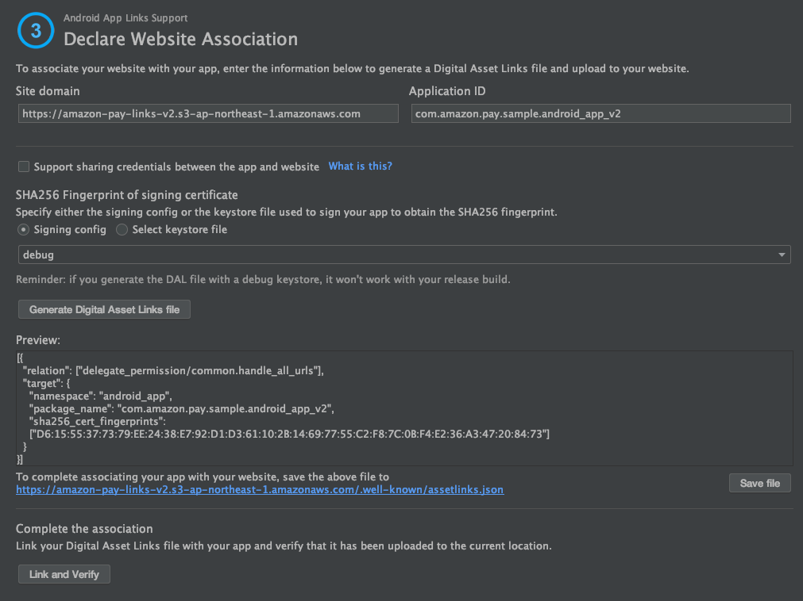

# Secure WebViewからアプリを起動する技術
Secure WebViewからアプリを起動するのに使える技術としては「Applinks」「Intent」「CustomURLScheme」等があり、それぞれ下記のメリット/デメリットがあります。
- Applinks  
  - メリット : 確実に指定したモバイルアプリを起動できるため、Secureである
  - デメリット : ユーザがLinkをタップしたときにしか発動しない
- Intent, CustomURLScheme
  - メリット : 条件によってはJavaScriptからでも発動できることがある
  - デメリット : 仕組み上、悪意のあるアプリが代わりに起動してしまうリスクを完全には排除できない

本サンプルアプリではセキュリティを考慮し、Applinksのみを使用しております。  

## Applinks
Applinksとは、特定のURLのLinkがChrome上でタップされたときに登録されたアプリを起動できる機能です。  
その特定のURLとモバイルアプリとのMappingはJSONファイルで定義されます。  
そのJSONファイルはモバイルアプリ開発者が管理するServer上に置かれて、モバイルアプリがInstall/Updateされたタイミングでこの情報がInternet経由で読み込まれます。  
そのServerがクラックされない限りはURLとモバイルアプリのMappingは確実に維持されるため、悪意のあるアプリが間違って起動されてしまう心配はありません。  

URLとアプリとのMappingを行うJSONファイルを生成するためのツールが用意されているので、そちらを使って新規にMapping用のJSONファイルを生成する方法を説明します。  

「Tool」→「App Links Assistant」を起動します。


起動したApp Links Assistantの①の、「Open URL Mapping Editor」をクリックします。  


「+」より、新しいMappingを追加します。  


「Host」に「https://{定義ファイルを配置する自身が管理するServerのドメイン}」、「Activity」では自分がMappingして起動したいActivityを選択します。  
※ 「Path」を指定することで一つの定義ファイルで複数のActivityとURLのMappingが管理できますが、ここでは説明は割愛します。  


「OK」でAndroidManifest.xmlに次のようなintent-filterが追加されます。  


アプリのインストール時・更新時に自動的にMappingがAndroidによって更新されるよう、下記のように「android:autoVerify="true"」という属性を手動で追加します。  


次に②の、「Select Activity」をクリックします。「Insert Code」をクリックすると、選択されたActivityにApplinksからの起動処理を受け取るロジックが追加されます。  


次に③の、「Open Digital Asset Links File Generator」をクリックすると下記が開くので、環境に合わせて適切な値にして「Generate Digital Asset Links file」をクリックします。  


「Save File」ボタンが出てきますので、こちらをクリックすると生成された定義ファイルの「assetlinks.json」を任意のFolderに保存できます。  


定義ファイル「assetlinks.json」をServerに配置します。  
このときの注意点としては、  
  * DomainがWebアプリケーションとは違うサーバーにすること  
  * httpsでファイルにアクセスできること  
  * ファイル取得時のContent-Typeは「application/json」とすること  
  * ファイルは「ドメインのルート/.well-known/」の下に配置すること  

などがあります。  
本サンプルではAWS S3を使用してこの「assetlinks.json」を配置しています。
AWS S3を使うと比較的簡単にできますので、ご参考にして見て下さい。  

定義ファイルの配置が完了したら、「Link and Verify」をクリックしてみて下さい。  
正しく設定できていれば、下のようにダイアログ下部に検証OKのメッセージが出力されます。  


④の「Test App Links」をクリックすると、Emulator上で検証できます。  
下記ダイアログが開くので、「Run Test」ボタンをクリックします。  


Emulator上での検証がOKなら、下記のように検証OKのメッセージが出力されます。


ここまでで、Nativeコードを呼び出す準備が整いました。  
後は「https://{'applinks.json'を配置したサーバーのドメイン}」/...」というURLのLinkをChrome Custom Tabs上でタップすれば、途中で指定したActivityに追加したコードが実行されるはずです。  

参考として、本サンプルの該当するNativeのコードを下記に示します。

```java
// MainActivity.javaから抜粋

                :
        // Applinksからintentを取得
        Intent intent = getIntent();
        if (intent.getScheme().equals("https")) {
            String appLinkAction = intent.getAction();
            Uri appLinkData = intent.getData();
            Log.d("[AppLink]", appLinkAction);
            Log.d("[AppLink]", "" + appLinkData);

            //　URLパラメータをparse
            Map<String, String> map = new HashMap<>();
            for (String kEqV : appLinkData.getEncodedQuery().split("&")) {
                String[] kv = kEqV.split("=");
                map.put(kv[0], kv[1]);
            }
                :
```

なお、Applinksが発動する条件は、基本的には「https://{'apple-app-site-association'を配置したサーバーのドメイン}」/...」というURLのLinkをChrome Custom Tabs上でタップしたときで、JavaScriptなどでこのURLをloadしても起動しないので注意が必要です。  
