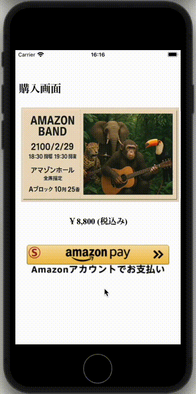
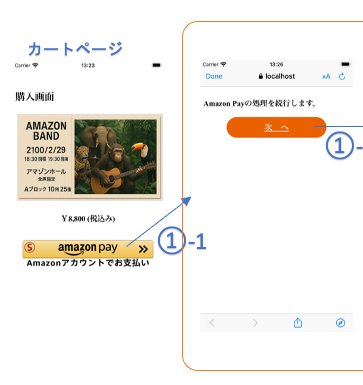
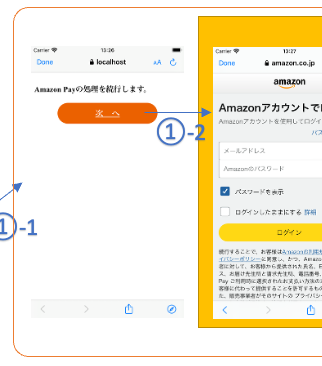
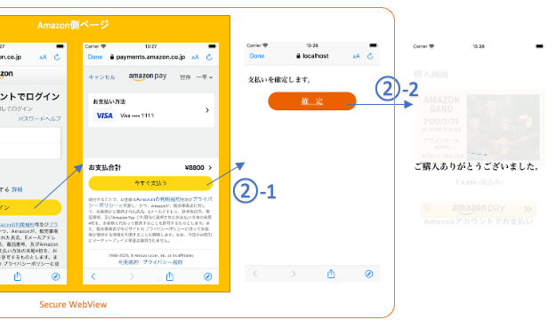
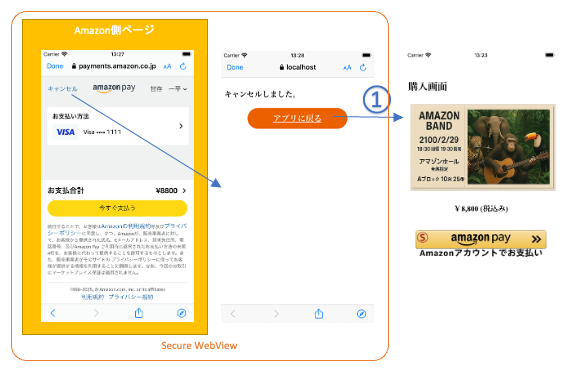
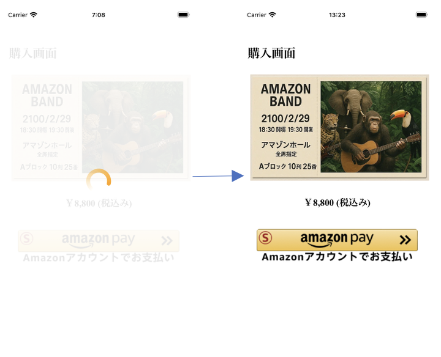

# Amazon Pay モバイル サンプルアプリ iOSアプリの実装について
本サンプルアプリの、iOSアプリ側の実装です。インストールして動作させる方法については、[こちら](./README_install.md)をご参照下さい。

# 動作環境
iOS バージョン12.3.1以降: Safari Mobile 12以降  
[参考] https://pay.amazon.com/jp/help/202030010

# その他の前提条件
本サンプルアプリではUniversal Linksという技術を使っており、こちらを利用するためには下記の条件が必要です。
 - [Apple Developer Program](https://developer.apple.com/jp/programs/)に登録していること 
 - Web上のhttpsで正しくアクセスできる場所に設定ファイルを配置する必要があるので、ECサイトとは別ドメインのサーバーか、AWS等のクラウドサービスのアカウントを保有していること  
   Note: 本サンプルアプリでは、[Amazon S3](https://aws.amazon.com/jp/s3/)を利用しています。こちらはアカウントをInternet上で簡単に取得でき、世界中で広く使われており、利用方法などの情報も多く、12ヶ月間 5GBの無料利用枠もあるため、お勧めです。  

# 概要
本サンプルアプリは、下記動画のように動作いたします。

  

以後詳細な実装方法について解説します。

# Amazon Payの実装方法

## カートページ

  

### モバイルアプリのJavaScript側からのCallback受付の設定
モバイルアプリではAmazon Payの処理はSecure WebView上で実行する必要がありますが、WebViewから直接Secure WebViewは起動できないため、WebViewのJavaScriptから一旦Nativeコードを起動できるよう設定する必要があります。  
それを行うのが下記のコードです。  

```swift
// ViewController.swiftから抜粋 (見やすくするため、一部加工しています。)

            // JavaScript側からのCallback受付の設定
            let userContentController = WKUserContentController()
            userContentController.add(self, name: "iosApp")
            let webConfig = WKWebViewConfiguration();
            webConfig.userContentController = userContentController
            
            // WebViewの生成、cartページの読み込み
            webView = WKWebView(frame: rect, configuration: webConfig)
                :
                :
extension ViewController: WKScriptMessageHandler {
    // JavaScript側からのCallback.
    func userContentController(_ userContentController: WKUserContentController, didReceive message: WKScriptMessage) {
        print("ViewController#userContentController")
                :
    }
}
```

このように設定すると、下記のようにJavaScript側からNative側にメッセージを送信することが可能になります。
```js
        webkit.messageHandlers.iosApp.postMessage(data);
```

### カートページの読み込み

[前提] 実際のECサイトではユーザはカートページを開くまでの間にサイトを操作してログインしたり商品を選んだりして、user sessionとカート情報が構築されます。  
こちらのサンプルではその状態をシミュレーションするため、下記のようにサーバー側にて固定値でそれぞれのダミーデータを用意します。  

```js
// nodejs/app.jsより抜粋

// ダミーのUserSession. 本来ならアカウントを持つユーザのLogin時に生成されてDB/Cacheサーバー等に保存されるが、本サンプルではシンプルにするため、固定とする.
const userSession = {
    account: 'user@sample.com',
    sessionId: 'xxxxxxxxxx'
};

// ダミーのカート情報設定関数。本来ならユーザが商品を選択するなどしてカート情報は生成されるが、本サンプルではシンプルにするため代わりに固定の値を代入する.
function setCartInfo() {
    userSession.cart = {
        // 金額データ.
        amount: {
            "paymentIntent": "Confirm",
            "totalBaseAmount": {"amount": "8000", "currencyCode": "JPY"},
            "totalTaxAmount": {"amount": "800", "currencyCode": "JPY"},
            "totalDiscountAmount": {"amount": "0", "currencyCode": "JPY"},
            "totalShippingAmount": {"amount": "0", "currencyCode": "JPY"},
            "totalOrderAmount": {"amount": "8800", "currencyCode": "JPY"},
            "chargeAmount": {"amount": "8800", "currencyCode": "JPY"}
        }
    };
}
```

モバイルアプリにて、WebViewでカートページを読み込みます。  

```swift
// ViewController.swiftから抜粋 (見やすくするため、一部加工しています。)

            let webUrl = URL(string: "http://localhost:3080/sample/cart?client=iosApp")!
            let myRequest = URLRequest(url: webUrl)
            webView.load(myRequest)
```

Requestがサーバーに送信され、サーバーではカート情報をパラメタとして「cart.ejs」というHTMLテンプレートを描画します。  
Note: [EJS](https://ejs.co/)はnodejsで使われれるHTMLテンプレートの一種ですが、構文はHTMLテンプレートとしては一般的なものであるため、比較的簡単に理解できるかと思います。  

```js
// nodejs/app.jsより抜粋

//-------------------
// Cart Screen
//-------------------
app.get('/sample/cart', async (req, res) => {
    setCartInfo();
    const locals = {...userSession.cart, token: ''};
    if(req.query.client === 'iosApp' || req.query.client === 'androidApp') {
        const token = crypto.randomBytes(18).toString('base64').replace(/[\/+]/g, c => c === '+' ? '-' : '_');
        storage.set(token, {cart: userSession.cart});
        locals.token = token;
    }
    res.render (
        'sample/cart.ejs', 
        locals
    );
});
```

なおモバイルアプリの場合には「Amazon Pay実行ページ」をSecure WebView上で表示する必要があり、そのパラメタとして後で利用するため必要な情報をstorageに保存し、アクセス用のtokenを発番します。  

### クライアント判定
本サンプルアプリでは、同一のHTML/JavaScriptの画面でAndroid/iOS/通常のBrowserの全てに対応しております。  
そのため、動作環境に応じて処理を切り替える必要がある場合には、クライアントを判定して条件分岐を行う必要があります。  
それを行っているのが、下記のJavaScriptのコードです。

```js
// nodejs/views/sample/cart.ejsより抜粋

    let client = "browser";
    if(window.androidApp) {
        client = "androidApp";
    } else if(window.webkit && webkit.messageHandlers && webkit.messageHandlers.iosApp) {
        client = "iosApp";
    }
```

上記「モバイルアプリのJavaScript側からのCallback受付の設定」で設定されたCallback用のObjectの存在確認を行うことで、それぞれ何の環境なのかを判定しています。  

### 「Amazon Payボタン」画像の表示

Amamzon Payで支払いができることをユーザに視覚的に伝えるのには、Amazon Payボタンを画面に表示するのが効果的です。  
WebView上では本物のAmazon Payボタンを配置できないので、ここでは画像を代わりに配置しています。  

それを行っているのが、下記のJavaScriptです。  
```js
// nodejs/views/sample/cart.ejsより抜粋 (見やすくするため、一部加工しています。)

        if(client === 'browser') { // ブラウザの場合、Amazon Payボタンの描画
            amazon.Pay.renderJSButton('#AmazonPayButton', {
                :
            });
        } else { // アプリの場合、Amazon Payボタンの画像を表示
            let node = document.createElement("input");
            node.type = "image";
            node.src = "/static/img/button_images/Gold/Sandbox-ja_jp-amazonpay-gold-large-button_T2.png";
            node.style.width = "90%";
            node.addEventListener('click', (e) => {
                        :
                    webkit.messageHandlers.iosApp.postMessage({op: 'doAmazonPay', token: '<%= token %>'});            
                        :
            });
            document.getElementById("AmazonPayButton").appendChild(node);
        }
```

最初の判定で、通常のBrowserだった場合にはそのままAmazon Payの処理が実施できるので、通常通りAmazon Payボタンを描画しています。  
モバイルアプリの場合は、「Amazon Payボタン」画像のnodeを生成して同画面内の「AmazonPayButton」ノードの下に追加することで画像を表示しています。  
この時指定する「Amazon Payボタン」画像は「./nodejs/static/img/button_images」の下にあるものから選ぶようにして下さい。なお、本番環境向けにファイル名が「Sandbox_」で始まるものを指定しないよう、ご注意下さい。  
この生成した画像がclickされたとき、Native側のCallbackを呼び出すEvent Handlerを追加しています。  

### 「Amazon Payボタン」画像クリック時の、Secure WebViewの起動処理
上記、「Amazon Payボタン」画像がクリックされたときに呼び出されるNative側のコードが、下記になります。  
パラメタの「op」に「doAmazonPay」が指定されているため、「invokeAmazonPayPage()」が呼び出されることになります。  

```swift
// ViewController.swiftから抜粋 (見やすくするため、一部加工しています。)

extension ViewController: WKScriptMessageHandler {
    // JavaScript側からのCallback.
    func userContentController(_ userContentController: WKUserContentController, didReceive message: WKScriptMessage) {
        switch message.name {
        case "iosApp":
            if let data = message.body as? NSDictionary {
                print(data)
                let op = data["op"] as! String?
                switch op! {
                case "doAmazonPay":
                    invokeAmazonPayPage(data["token"] as! String)
                default:
                    return
                }
            }
        default:
            return
        }
    }
}
```

「invokeAmazonPayPage()」の処理が、下記になります。  
```swift
// ViewController.swiftから抜粋 (見やすくするため、一部加工しています。)

    var token: String?
        :
    func invokeAmazonPayPage(_ _token: String) {
        print("ViewController#invokeButtonPage")
        
        token = _token
        let safariView = SFSafariViewController(url: NSURL(string: "https://127.0.0.1:3443/doAmazonPay?token=\(token!)")! as URL)
        present(safariView, animated: true, completion: nil)
    }
```
Note: パラメタとして受け取ったアクセス用tokenをNative側でFieldに保持していますが、こちらは後でセキュリティチェック処理に用いられます。  

URLを指定して、SFSafariViewController(iOS側のSecure WebView)を起動しているのが分かると思います。  
なお、SFSafariViewController起動時に指定されているURLは、「Amazon Pay実行ページ」のもので、これがSecure WebView上で読み込まれることになります。  

## Amazon Pay実行ページ - Amazon Pay起動編

  

Amazon Pay cPSPにおけるAdditionalPaymentButton(APB)では、「BuyNow」という機能がベースになっております。  
こちらのBuyNowでは通常、ECサイトを親ページとした子ページ(Modal Window)として、Amazon側ページを開き、ECサイトとAmazon側ページが「window.postMessage()」というブラウザのwindow同士で通信する仕組みを活用することで決済処理を実現しています。  
しかしモバイルアプリでは通常ECサイトにあたるのはモバイルアプリであり、Secure WebView上に表示されるAmazon側ページとの通信でこの仕組みを使うことができません。  
そのためモバイルアプリでは、ECサイトに代わってAmazon側ページと通信を行う親ページがSecure WebView上に必要で、これをここでは「Amazon Pay実行ページ」と呼んでいます。  

### Server側の処理
Amazon Pay実行ページ表示のRequestを受け付けます。  

```js
// nodejs/app.jsより抜粋 (見やすくするため、一部加工しています。)

//-----------------------------------------------------------------------------------------
// Amazon Pay実行ページ (Secure WebViewからのRequestなので、userSessionにはアクセスできない想定)
//-----------------------------------------------------------------------------------------
app.get('/doAmazonPay', async (req, res) => {
    let stored = storage.get(req.query.token);
        :
    console.log(`doAmazonPay: ${JSON.stringify(stored, null, 2)}`);
    res.render ('doAmazonPay.ejs', stored.cart);
});
```

先程storageに保存した情報をアクセス用tokenを使って取得し、それをパラメタとして「doAmazonPay.ejs」というHTMLテンプレートを描画します。  

### Amazon Pay起動処理
「doAmazonPay.ejs」ではまずはAmazon Payの処理を起動する必要があるため、まずはAmazon Payボタンを描画します。  

```html
<!-- nodejs/views/doAmazonPay.ejsより抜粋 (見やすくするため、一部加工しています。) -->

                :
    <script src="https://static-fe.payments-amazon.com/checkout.js"></script>
    <script type="text/javascript" charset="utf-8">
        amazon.Pay.renderJSButton('#AmazonPayButton', {
            // set checkout environment
                :
        }
                :
    </script>
```

Amazon Payボタンについては、その画像が既にモバイルアプリ側で表示されており、ここで再度同じものが表示されるとユーザに違和感を与えるため、対象となる「AmazonPayButton」ノードは下記のように非表示に設定されています。  

```html
<!-- nodejs/views/doAmazonPay.ejsより抜粋 (見やすくするため、一部加工しています。) -->

    <div id="ExecDiv" style="display: flex; flex-direction: column;">
        <h3>Amazon Payの処理を続行します。</h3>
        <a id="ExecButton" href="#" class="LinkButton">
            次　へ
        </a>
        <div id="AmazonPayButton" style="display: none"></div>
    </div>
```

画面上に表示されているのはその上の「ExecButton」ノードで、こちらをクリックすると下記のコードより非表示のAmazon Payボタンがクリックされて、Amazon Payの処理が起動します。

```js
// nodejs/views/doAmazonPay.ejsより抜粋 (見やすくするため、一部加工しています。)

        document.getElementById('ExecButton').addEventListener('click', (e) => {
            document.getElementById('AmazonPayButton').click();
        });
```

## Amazon Pay実行ページ - 支払処理編

  

注文確定は支払完了となる処理であるため、可能な限りSecureに実行する必要があり、有効なUser Sessionと紐づけて行うのが一般的です。  
モバイルアプリでは通常User Sessionはアプリ側で保持されており、User Sessionに直接アクセスできないSecure WebView上では注文確定の手前まで処理を進め、注文確定はアプリに戻ってから実行します。  


### 注文確定手前まで決済処理を進め、モバイルアプリに戻る

Amazon側ページにて「今すぐ支払う」ボタンをタップすると、親ページでAmazon Payボタンを描画したときにパラメタとして渡した「onCompleteCheckout」というEvent Handlerが起動します。  
ここでの親ページはAmazon Pay実行ページであり、該当のEvent Handlerのコードは下記になります。  

```js
// nodejs/views/doAmazonPay.ejsより抜粋 (見やすくするため、一部加工しています。)

            /** Invokes when customer clicks Pay Now **/
            onCompleteCheckout: async function (event) {
                console.log(event);
                try {
                    const res = await fetch('/sample/compData', {
                        method: 'POST',
                        headers: {"Content-Type": "application/json"},
                        body: JSON.stringify({
                            billingAddress: event.billingAddress,
                            paymentDescriptor: event.paymentDescriptor,
                            chargePermissionId: event.amazonChargePermissionId,+                            amazonPayCheckoutType: event.amazonPayCheckoutType,
                            amazonPayMFAReturnUrl: event.amazonPayMFAReturnUrl,  // Needed for MFA use-case
                        })
                    });
                        :
```

こちらは該当のEvent Handlerの前半で、パラメタとして受け取った値等を指定してサーバー側の処理を呼び出しているところまでです。  
このRequestにより呼び出されるサーバー側の処理が下記です。  

```js
//-------------------------------------------------------------------------------------------------
// Transaction実行 & 結果の保存 (Secure WebViewからのRequestなので、userSessionにはアクセスできない想定)
//-------------------------------------------------------------------------------------------------
app.post('/sample/compData', async (req, res) => {
    let resBody = null;
    try {
        const stored = storage.get(req.cookies.token);
        const result = await execTran(req.body, stored.cart);
        const compToken = crypto.randomBytes(18).toString('base64').replace(/[\/+]/g, c => c === '+' ? '-' : '_');
        storage.set(compToken, {result, token: stored.originalToken});
        resBody = {status: 'OK', compToken: compToken};
    } catch (err) {
        console.error(err);
        resBody = {status: 'NG', message: '決済に失敗しました。やり直して下さい。'};
    }
    res.writeHead(200, {'Content-Type': 'application/json; charset=UTF-8'});
    res.write(JSON.stringify(resBody));
    res.end()
});
    :
async function execTran(params, cart) {
    const orderId = crypto.randomBytes(13).toString('hex');
    const access = await callAPI('EntryTranAmazonpay', {
        ...keyinfo,
        OrderID: orderId,
        JobCd: 'AUTH',
        Amount: `${cart.amount.chargeAmount.amount}`,
        AmazonpayType: '4',
    });

    const tran = await callAPI('ExecTranAmazonpay', {
        ...keyinfo,
        ...access,
        OrderID: orderId,
        RetURL: params.amazonPayMFAReturnUrl,
        AmazonChargePermissionID: params.chargePermissionId,
        ApbType: 'PayOnly',
        Description: "ご購入ありがとうございます。",
    });

    // Security Check
    const textToHash = `${orderId}${access.AccessID}${keyinfo.ShopID}${keyinfo.ShopPass}${params.chargePermissionId}`;
    const hash = crypto.createHash('sha256').update(textToHash).digest('hex');
    console.log(`Hash: ${hash}`);
    if(hash !== tran.CheckString) throw new Error('CheckStringが一致しません。');

    return [access, tran];
}
```

Requestのbodyと、アクセス用tokenで保存したcart情報をパラメタとして、GMO−PGのAPIを呼び出して注文を実行します。  
処理結果は「compToken」というtokenを発行してstorageに保存し、ResponseとしてこのcompTokenを返却しています。  
このResponseを処理するのがEvent Handlerの後半です。  

```js
// nodejs/views/doAmazonPay.ejsより抜粋 (見やすくするため、一部加工しています。)

            /** Invokes when customer clicks Pay Now **/
            onCompleteCheckout: async function (event) {
                        :
                    const result = await res.json();
                    console.log(result);

                    if(res.status === 200 && result.status === 'OK') { // 成功
                        document.getElementById("CompButton").href = `https://dzpmbh5sopa6k.cloudfront.net/complete?compToken=${result.compToken}`;
                        document.getElementById("CompDiv").style.display = 'flex'
                        document.getElementById('ExecDiv').style.display = 'none'
                        document.getElementById('CancelDiv').style.display = 'none'
                        return {status: "success"}; // [“success”, “decline”, “error”] return the status of the payment processing
                    } else { // 失敗
                        backToApp(result.message);
                        return {status: "decline"}; // [“success”, “decline”, “error”] return the status of the payment processing
                    }
                } catch (err) { // 想定外エラー
                    console.error(err);
                    backToApp(`エラーが発生しました。やり直して下さい。`);
                    return {status: "error"}; // [“success”, “decline”, “error”] return the status of the payment processing
                }
            },
```

Responseが成功なら支払確定ボタンにUniversal LinkのURL(後述)を設定してから画面を切り替えて支払確定ボタンを表示し、失敗や想定外エラーならエラーメッセージを画面に表示します。  
このUniversal Linksの詳細は[こちら](./README_swv2app.md)に記載されています。こちらが設定されているLinkをタップすることでモバイルアプリに戻ることができます。  

### モバイルアプリからWebView内の関数を起動して、注文確定
このUniversal Linksにより起動されるのが、下記のNativeコードになります。  

```swift
// AppDelegate.swiftより抜粋　(見やすくするため、一部加工しています。)

    func application(_ application: UIApplication, continue userActivity: NSUserActivity, restorationHandler: @escaping ([UIUserActivityRestoring]?) -> Void) -> Bool {
        print("Universal Links!")
        if userActivity.activityType == NSUserActivityTypeBrowsingWeb {
            print(userActivity.webpageURL!)
            
            // ViewControllerの取得
            let vc:ViewController? = UIApplication.shared.keyWindow?.rootViewController as? ViewController
            
            if userActivity.webpageURL!.lastPathComponent == "complete" { // 決済実行
                // URLパラメタのパース
                var urlParams = Dictionary<String, String>.init()
                for param in userActivity.webpageURL!.query!.components(separatedBy: "&") {
                    let kv = param.components(separatedBy: "=")
                    urlParams[kv[0]] = kv[1].removingPercentEncoding
                }
                
                // ViewControllerにパラメタを設定
                vc?.webviewParams = (vc?.token)! + "&" + urlParams["compToken"]!
            } else if userActivity.webpageURL!.lastPathComponent == "cancel" { // キャンセル
                // 必要に応じて実装する.
            }

            // SFSafariViewConrollerの取得(表示されていた場合のみ)
            let sfsv = vc?.presentedViewController
            
            // SFSafariViewのclose (この後、ViewController#viewDidAppearに処理が移る)
            (sfsv as? SFSafariViewController)?.dismiss(animated: false, completion: nil)
        }
        return true
    }
```

今回指定されたUnivasal LinksのURLでは、path部分が「complete」であったため、上記「決済実行」とコメントされたブロックが実行されます。  
ここではUnivasal LinksのURLに指定されたURLパラメタの「compToken」を取得し、上記『「Amazon Payボタン」画像クリック時の、Secure WebViewの起動処理』でモバイルアプリ側に保持されたアクセス用tokenと合わせて「ViewController#webviewParams」に代入します。  

このあと、Secure WebViewをcloseすると、ViewController#viewDidAppearに処理が移ります。  
ViewController#viewDidLoadの該当の処理は下記の通りです。  

```swift
// ViewController.swiftから抜粋 (見やすくするため、一部加工しています。)

    var token: String?
    var webviewUrl: String?
    var webviewParams: String?

    var webView: WKWebView!
    
    override func viewDidAppear(_ animated: Bool) {
        super.viewDidAppear(animated)
        print("ViewController#viewDidAppear")

        if webView == nil {
            :
        } else {
            let url = webviewUrl
            let params = webviewParams
            webviewUrl = nil
            webviewParams = nil
            if(url != nil) {
                webView.evaluateJavaScript("loadUrl('\(url!)')", completionHandler: nil)
            } else if(params != nil) {
                webView.evaluateJavaScript("onCompleteCheckout('\(params!)')", completionHandler: nil)
            } else {
                webView.evaluateJavaScript("if(window.uncoverScreen) {uncoverScreen();}", completionHandler: nil)
            }
        }
    }
```

Fieldの「webView」はモバイルアプリ初回起動時にインスタンスが代入されてnullではなくなっているため、上記はelse節以降が実行されます。  
ここで、「webviewParams」にはtokenとcompTokenの値が代入されているため、if文分岐は2番目の、

```swift
            } else if(params != nil) {
                webView.evaluateJavaScript("onCompleteCheckout('\(params!)')", completionHandler: nil)
```

の部分が実行されます。これにより、現在WebView上で開いているECサイトのページ内に実装されている「onCompleteCheckout」が実行されます。  
こちらのコードは下記の通りです。  

```js
// nodejs/views/sample/cart.ejsより抜粋 (見やすくするため、一部加工しています。)

        async function onCompleteCheckout (event) {
            const params = typeof event === "string" ? {
                token: event.substr(0, event.indexOf('&')),
                compToken: event.substr(event.indexOf('&') + 1)
            } : {
                billingAddress: event.billingAddress,
                paymentDescriptor: event.paymentDescriptor,
                chargePermissionId: event.amazonChargePermissionId,
                amazonPayCheckoutType: event.amazonPayCheckoutType,
                amazonPayMFAReturnUrl: event.amazonPayMFAReturnUrl  // Needed for MFA use-case
            };
            try {
                const res = await fetch('/sample/createCharge', {
                    method: 'POST',
                    headers: {"Content-Type": "application/json"},
                    body: JSON.stringify(params)
                });

                const result = await res.json();
                    :
```

こちらは該当の「onCompleteCheckout」の前半部分です。  
この決済実行用の関数はブラウザとMobileとで共有されており、関数冒頭はその分岐になります。  
今回の、モバイルアプリからの関数が呼び出された場合はパラメタがstringなので、こちらをParseしてtokenとcompTokenに分けて、それをパラメタとしてサーバーの処理を起動しています。  
起動されるサーバーの処理は下記の通りです。  

```js
//-------------
// 決済処理
//-------------
app.post('/sample/createCharge', async (req, res) => {
    console.log(`createCharge: ${JSON.stringify(req.body, null, 2)}`);
    let resBody = null;
    try {
        // Transaction実行
        let access, tran;
        if(req.body.compToken) { // モバイルアプリの場合、Secure WebViewで実行済みなので保存された結果の取得.
            const stored = storage.get(req.body.compToken);
            if(stored.token !== req.body.token) throw new Error(`tokenが一致しません。${stored.token} != ${req.body.token}`);
            [access, tran] = stored.result;
        } else {
            [access, tran] = await execTran(req.body, userSession.cart);
        }
        save(userSession, access, tran); // 受注情報のDB等への保存

        // 注文確定(※ 配送が必要な商品の場合には、配送手続き完了後に実行します。)
        const sales = await callAPI('AmazonpaySales', {
            ...keyinfo,
            ...access,
            OrderID: tran.OrderID,
            Amount: `${userSession.cart.amount.chargeAmount.amount}`,
        });
        save(userSession, sales); // 受注情報のDB等への保存
        resBody = {status: 'OK', message: 'ご購入ありがとうございました。'};
    } catch (err) {
        console.error(err);
        resBody = {status: 'NG', message: '決済に失敗しました。やり直して下さい。'};
    }

    res.writeHead(200, {'Content-Type': 'application/json; charset=UTF-8'});
    res.write(JSON.stringify(resBody));
    res.end()
});
```

こちらもブラウザとMobileとで共有された処理になります。冒頭にてリクエストのパラメタに「compToken」がある・なしで分岐しておりますが、今回のモバイルアプリのケースは「compToken」がある場合になります。  
この場合、compTokenからサーバー側に保存されたデータを取り出します。
このときSecurity checkとして、モバイルアプリから渡されたアクセス用tokenがサーバーに保存された値を一致するかを判定しています。これにより、処理の途中でユーザや環境が入れ替わっていないことを確認しています。  
取得したデータをパラメタとして以降のGMO−PGのAPIを呼び出しを行い、注文を確定して処理結果をResponseとして返却します。  
このResponseを処理するのが「onCompleteCheckout」の後半です。  

```js
// nodejs/views/sample/cart.ejsより抜粋 (見やすくするため、一部加工しています。)

        async function onCompleteCheckout (event) {
                    :
                showMsg(result.message); // TODO 本サンプルでは決済結果の画面表示しかしていませんが、ECサイトの要件に応じてThanksページへの遷移などに変更して下さい。

                if(res.status === 200 && result.status === 'OK') { // 成功
                    return {status: "success"}; // [“success”, “decline”, “error”] return the status of the payment processing
                } else { // 失敗
                    return {status: "decline"}; // [“success”, “decline”, “error”] return the status of the payment processing
                }
            } catch (err) { // 想定外エラー
                console.error(err);
                showMsg(`エラーが発生しました。やり直して下さい。`);
                return {status: "error"}; // [“success”, “decline”, “error”] return the status of the payment processing
            }
        }
            :
        function showMsg(msg) {
            document.getElementById('message').textContent = msg || '';
            uncoverScreen();
            document.getElementById('message_cover').style.display = 'flex';
        }
```

サーバーから返ってきたメッセージを画面上に表示してユーザに知らせます。    

本サンプルアプリの決済完了までの流れとしては、以上となります。  

## Amazon Pay実行ページ - キャンセル編
  

最後に、Amazon側ページ上で「キャンセル」がタップされたときの実装について説明します。  
キャンセル時には親ページであるAmazon Pay実行ページの「onCancel」が呼び出されます。  

```html
<!-- nodejs/views/doAmazonPay.ejsより抜粋 (見やすくするため、一部加工しています。) -->

    <div id="CancelDiv" style="display: none; flex-direction: column;">
        <h3 id="message"></h3>
        <a id="cancel" href="https://dzpmbh5sopa6k.cloudfront.net/cancel" class="LinkButton">
            アプリに戻る
        </a>
    </div>
                :
    <script type="text/javascript" charset="utf-8">
                :
            /** Invokes when customer abandons the checkout **/
            onCancel: function (event) {
                // take customer back to cart page or product details page based on merchant checkout
                console.log(`onCancel called. - event: ${event}`);
                backToApp('キャンセルしました。')
            },
                :
        function backToApp(msg) {
            document.getElementById('ExecDiv').style.display = 'none'
            document.getElementById('message').textContent = msg || '';
            document.getElementById('CancelDiv').style.display = 'flex'
        }
                :
    </script>
```

現在表示されているはずの支払確定ボタンを非表示にして、messageノードに「キャンセルしました。」を代入し、「アプリに戻る」ボタン共々表示状態にします。  
「アプリに戻る」ボタンには単にアプリに戻るだけのUniversal Linksが設定されています。  
こちらをタップしたときに起動するNativeコードが下記です。  

```swift
// AppDelegate.swiftから抜粋 (見やすくするため、一部加工しています。)
    func application(_ application: UIApplication, continue userActivity: NSUserActivity, restorationHandler: @escaping ([UIUserActivityRestoring]?) -> Void) -> Bool {
        print("Universal Links!")
        if userActivity.activityType == NSUserActivityTypeBrowsingWeb {
            print(userActivity.webpageURL!)
            
            // ViewControllerの取得
            let vc:ViewController? = UIApplication.shared.keyWindow?.rootViewController as? ViewController
            
            if userActivity.webpageURL!.lastPathComponent == "complete" { // 決済実行
                :
            } else if userActivity.webpageURL!.lastPathComponent == "cancel" { // キャンセル
                // 必要に応じて実装する.
            }

            // SFSafariViewConrollerの取得(表示されていた場合のみ)
            let sfsv = vc?.presentedViewController
            
            // SFSafariViewのclose (この後、ViewController#viewDidAppearに処理が移る)
            (sfsv as? SFSafariViewController)?.dismiss(animated: false, completion: nil)
        }
        return true
    }
```

今回指定されたUnivasal LinksのURLでは、path部分が「cancel」であったため、上記「キャンセル」とコメントされたブロックが実行されます。  
ここでは特に何もしていないですが、必要に応じてキャンセル時に必要な処理をご実装下さい。  
その後、Secure WebViewがcloseされて「ViewController#viewDidAppear」に処理が移ります。  

```swift
// ViewController.swiftから抜粋 (見やすくするため、一部加工しています。)
    var token: String?
    var webviewUrl: String?
    var webviewParams: String?

    var webView: WKWebView!

    override func viewDidAppear(_ animated: Bool) {
        super.viewDidAppear(animated)
        print("ViewController#viewDidAppear")

        if webView == nil {
            :
        } else {
            let url = webviewUrl
            let params = webviewParams
            webviewUrl = nil
            webviewParams = nil
            if(url != nil) {
                webView.evaluateJavaScript("loadUrl('\(url!)')", completionHandler: nil)
            } else if(params != nil) {
                webView.evaluateJavaScript("onCompleteCheckout('\(params!)')", completionHandler: nil)
            } else {
                webView.evaluateJavaScript("if(window.uncoverScreen) {uncoverScreen();}", completionHandler: nil)
            }
        }
    }
```

webviewUrlにもwebviewParamsにも値を代入していないため、if文分岐は三番目の下記が実行されます。  

```js
            } else {
                webView.evaluateJavaScript("if(window.uncoverScreen) {uncoverScreen();}", completionHandler: nil)
```

これにより実行されるWebView上のECサイトの関数「uncoverScreen」は下記の通りです。  

```js
        function uncoverScreen() {
            document.getElementById('white_cover').style.display = 'none';
        }
```

ECサイト側で、処理中を表すためのwhite_coverノードが下記のように表示状態になっていた場合、これを非表示にして通常状態のECサイトに戻すことができます。  

  
