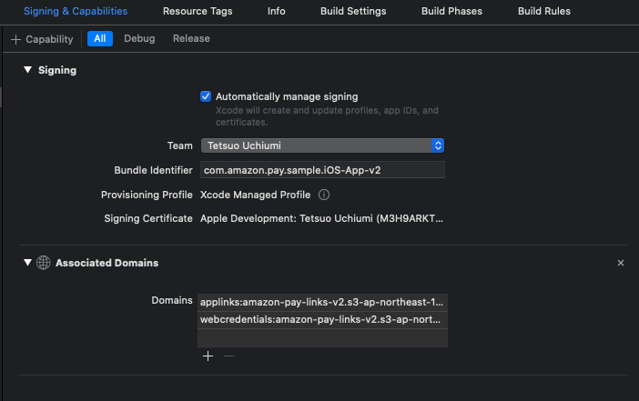

# Secure WebViewからアプリを起動する技術
Secure WebViewからアプリを起動するために、「Universal Links」「CustomURLScheme」があり、それぞれ下記のメリット/デメリットがあります。
- Universal Links  
  - メリット : 確実に指定したモバイルアプリを起動できるため、Secureである
  - デメリット : ユーザがLinkをタップしたときにしか発動しない
- CustomURLScheme
  - メリット : JavaScriptからでも発動できる
  - デメリット : 仕組み上、悪意のあるアプリが代わりに起動してしまうリスクを完全には排除できない

本サンプルアプリではセキュリティを考慮し、Universal Linksのみを使用しております。  

## Universal Links
Universal Linksとは、特定のURLのLinkがSafari上でタップされたときに登録されたアプリを起動できる機能です。  
その特定のURLとモバイルアプリとのMappingはJSONファイルで定義されます。  
そのJSONファイルはモバイルアプリ開発者が管理するServer上に置かれて、モバイルアプリがInstall/Updateされたタイミングでこの情報がInternet経由で読み込まれます。  
そのServerがクラックされない限りはURLとモバイルアプリのMappingは確実に維持されるため、悪意のあるアプリが間違って起動されてしまう心配はありません。  

URLとアプリとのMappingを行うJSONファイルは、下記のようになります。  

```json
{
    "applinks": {
        "apps": [],
        "details": [
            {
                "appID":"XXXXXXXX.com.amazon.pay.sample.iOS-App-v2",
                "paths":[ "*" ]
            }
        ]
    }
}
```

こちらのJSONファイル内の「appID」は、"{TeamID}.{Bundle Identifier}"で構成されます。  
TeamIDは、ご自身のAppleアカウントでApple Developer Centerにログインし、「Membership」→ 「Team ID」で確認できます。  
またBundle Identifierは、Xcodeで設定の「General」「Signing & Capabilities」等で確認できます。  

こうして作成したファイルは、「apple-app-site-association」という名前で保存します。   

この「apple-app-site-association」を、自身が管理するServerに配置します。  
このときの注意点としては、  
  * DomainがWebアプリケーションとは違うサーバーにすること  
  * httpsでファイルにアクセスできること(自己証明書ではなく、iOSが認識できる正しい証明書を使っていること)  
  * ファイル取得時のContent-Typeは「application/json」とすること  
  * ファイルは「ドメインのルート/.well-known/」の下に配置すること  

などがあります。  
[こちら](https://dev.classmethod.jp/articles/universal-links/)の方のように、[Amazon S3](https://aws.amazon.com/jp/s3/)を使うと比較的簡単にできますので、ご参考にして見て下さい。  
※ 本サンプルでも、Amazon S3を使って「apple-app-site-association」を配置しております。  

そしてAssociated Domainsを追加します。  
Xcodeで「Signing & Capabilities」を開き、左上の「+ Capability」から「Associated Domains」を追加します。  
※ この操作により、Apple Developer Centerで「Certificates, Identifiers & Profiles」→ 「Identifiers」にアプリのBundle Identifierが自動的に登録されます。  

  

こうして表示されたAssociated Domainsに、上記画像のように下記二つを登録します。
  * applinks:{上記「apple-app-site-association」を配置したサーバーのドメイン}  
  * webcredentials:{上記「apple-app-site-association」を配置したサーバーのドメイン}  

ここまでで、Nativeコードを呼び出す準備が整いました。  
後は「https://{'apple-app-site-association'を配置したサーバーのドメイン}」/...」というURLのLinkをSFSafariViewController上でタップすれば、AppDelegate.swiftに追加した下記のコードが実行されます。

```swift
// AppDelegate.swiftより抜粋
    func application(_ application: UIApplication, continue userActivity: NSUserActivity, restorationHandler: @escaping ([UIUserActivityRestoring]?) -> Void) -> Bool {
        print("Universal Links!")
        if userActivity.activityType == NSUserActivityTypeBrowsingWeb {
            print(userActivity.webpageURL!)
                :
        }
        return true;
    }
```

Note: 上記はSwift5の場合。Swift4以前の場合は下記。
```swift
    func application(_ application: UIApplication, continue userActivity: NSUserActivity, restorationHandler: @escaping ([Any]?) -> Void) -> Bool {
        print("Universal Links!")
        if userActivity.activityType == NSUserActivityTypeBrowsingWeb {
            print(userActivity.webpageURL!)
                :
        }
        return true;
    }
```

なお、こちらのUniversal Linksにより上記コードが起動するのは、上にも書いたとおり「https://{'apple-app-site-association'を配置したサーバーのドメイン}/...」というURLのLinkをタップしたときだけで、JavaScriptなどでこのURLをloadしても起動しないので注意が必要です。  
