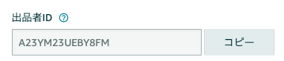
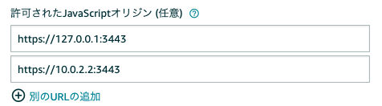

# Amazon Pay モバイル サンプルアプリ Webアプリケーション側の実装について
本サンプルアプリ全体の、Webアプリケーション側の実装です。

## 動作環境
nodejs: v16.20.2 以上  
※ おそらくもっと下のVersionでも動作しますが、動作テストはしていません。  
(参考) インストーラー & package managerを使ったインストール:  
  - https://nodejs.org/ja/download/
  - https://nodejs.org/ja/download/package-manager/

## 概要
本Webアプリケーションでは、WebView・Secure WebViewからのrequest受付・画面の出力 及び 画面遷移・Amazon Pay APIの呼出＆決済処理等を行っております。  
より詳細な動作については、[android](../android/README.md)、[ios](../ios/README.md)側の説明や、コードをご参照下さい。

# server側のインストール

## リポジトリのclone
もしまだであれば、まずは本リポジトリをcloneして下さい。  
cloneされてできたディレクトリの下の「nodejs」ディレクトリの下が、こちらのWebアプリケーションのプロジェクトになります。  

## GMO-PGの設定

nodejs/keys/template ディレクトリ下の、
  - keyinfo.js  

を一階層上の nodejs/keys ディレクトリ直下にコピーし、GMO-PGのご自身のアカウントのShopID, ShopPassをそれぞれ設定します。  
```js
exports.keyinfo = {
    ShopID: 'tshopXXXXXXXX',
    ShopPass: 'XXXXXXXX',
};
```

## Seller Centralの設定

Seller Centralにログインしてインテグレーションセントラルを開きます。出品者ID(以下、Merchant ID)が表示されるので、こちらを控えておきます。  



次に同ページの「アプリケーションの管理」の「アプリケーションを確認する」ボタンをクリックします。  
「アプリ名またはストア名」の選択メニューより、該当のアプリを選択します。Store IDが表示されるので、こちらも控えておきます。  

- ./views/sample/cart.ejs
- ./views/doAmazonPay.ejs

のJavaScriptコード内の、下記```amazon.Pay.renderJSButton()```のパラメタのmerchantId, storeIdにそれぞれ控えた値を設定します。  

```js
            amazon.Pay.renderJSButton('#AmazonPayButton', {
                // set checkout environment
                merchantId: 'XXXXXXXXXXXXXXXXXXXXXXXXX',
                    :
                // provide checkout configuration generated in previous step
                checkoutSessionConfig: {
                    storeId: "amzn1.application-oa2-client.xxxxxxxxxxxxxxxxxxxxxxxxxxxxx",
                    scopes: ["name", "email", "phoneNumber", "billingAddress"],
```

次に同ページの「編集する」をクリックし、JavaScriptオリジンに、
- https://127.0.0.1:3443
- https://10.0.2.2:3443

をそれぞれ設定して「変更を保存する」をクリックして保存します。  




## Webサーバーのhttps設定
[こちら](./ssl/README.md)のコマンドを実行し、https通信用の鍵と証明書を作成します。

## 依存モジュールのインストール
本ディレクトリにて、下記のコマンドを実行して依存モジュールをインストールします。
```sh
npm i
```

## サーバーの起動
本ディレクトリにて、下記コマンドを実行します。
```sh
node app.js
```

### browserでのテスト
[https://127.0.0.1:3443/sample/cart](https://127.0.0.1:3443/sample/cart) にアクセスします。セキュリティの警告を無視してすすめると、下記画面が表示されます。


本サンプルアプリはPC/Mobile上のブラウザでも動作しますので、アプリの動作の確認や挙動の理解にご活用ください。
